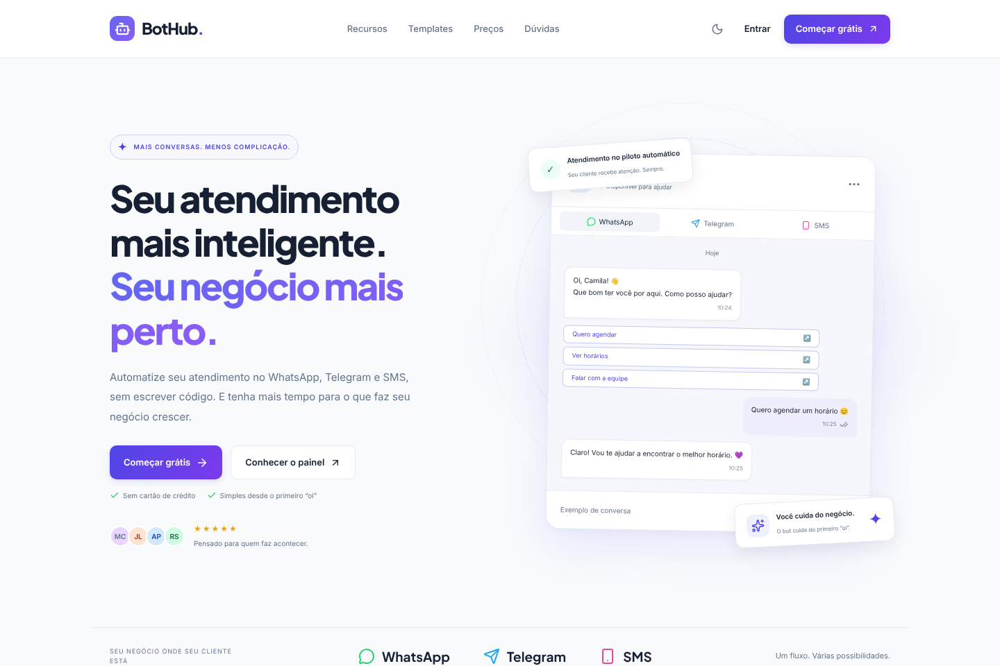
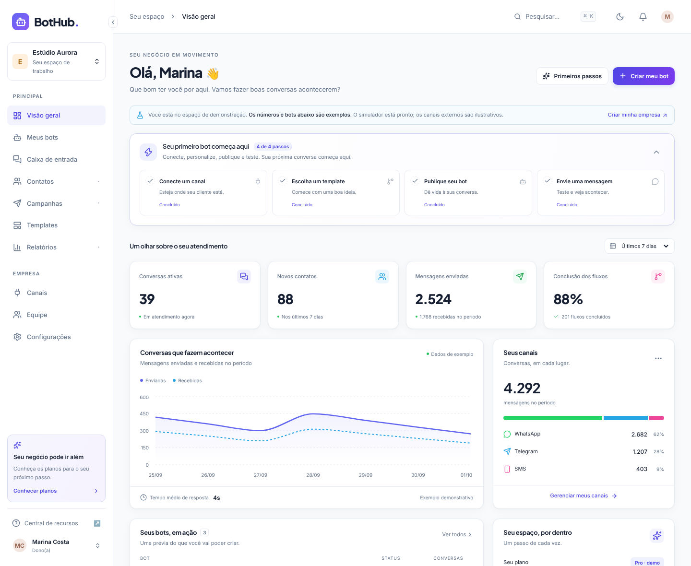
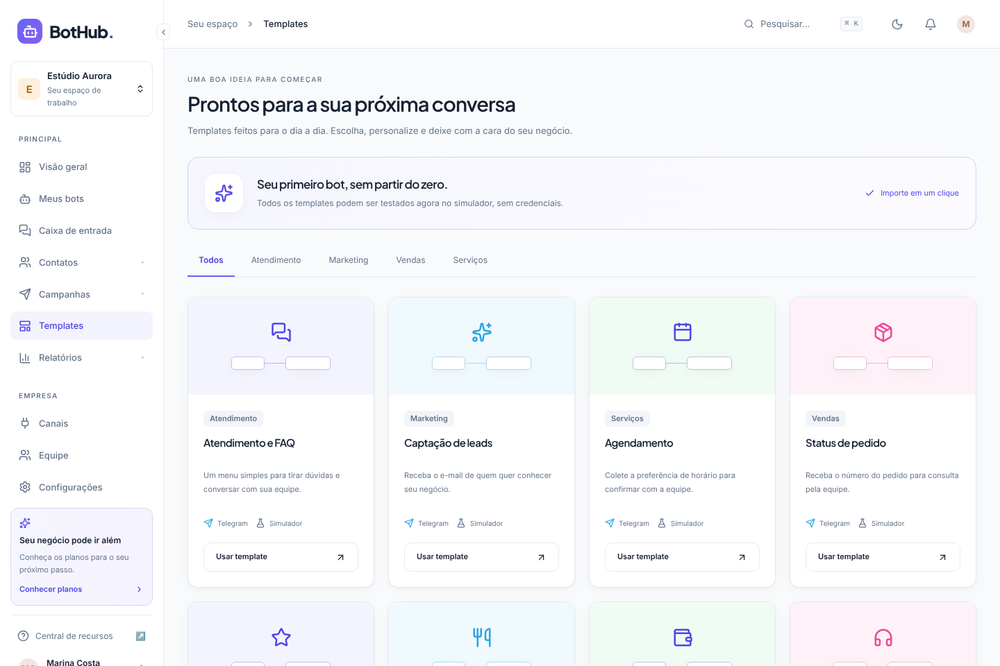
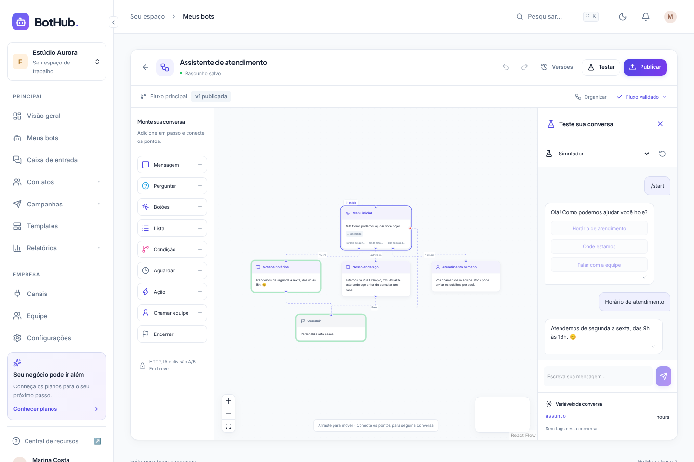
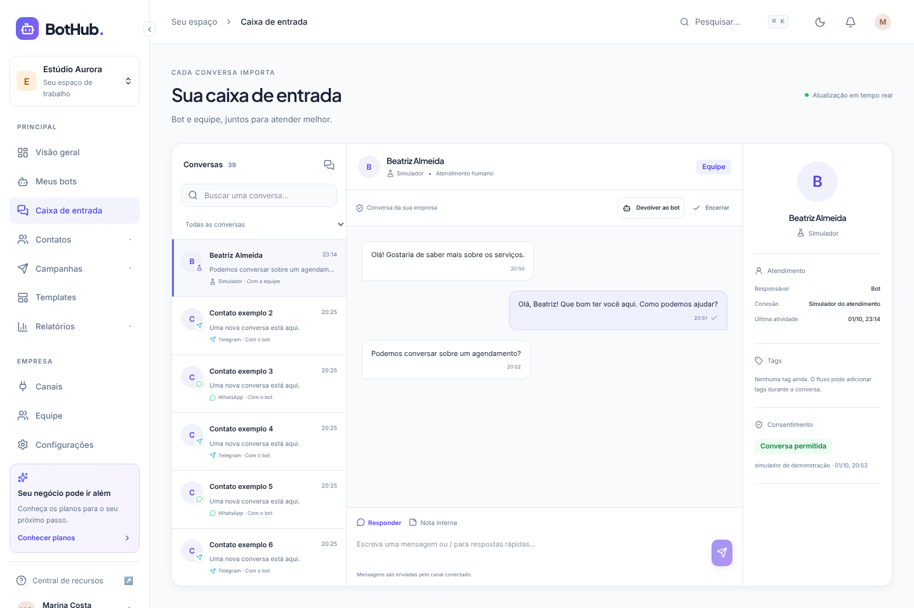
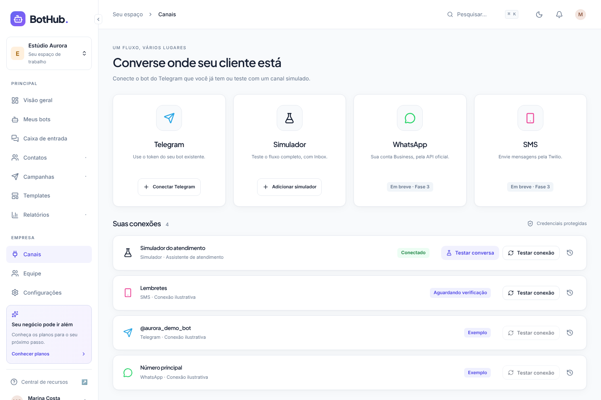
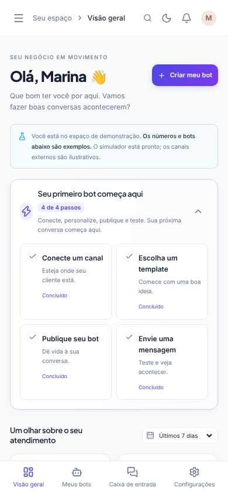

# Demonstração visual do BotHub

Estas são capturas do aplicativo funcionando, com dados fictícios do workspace de demonstração. O simulador executa o motor de fluxos sem enviar mensagens a canais externos.

## 1. Página inicial

A apresentação do produto tem um exemplo de conversa que alterna entre WhatsApp, Telegram e SMS, botões de cadastro, recursos e preços. As seções seguintes ficam abaixo do trecho capturado.

## 2. Painel da empresa

O painel reúne o checklist inicial, conversas ativas, novos contatos, mensagens e conclusão dos fluxos. Os números e gráficos desta conta são exemplos, identificados na interface.

## 3. Templates

Oito modelos podem ser importados para começar o bot: atendimento, leads, agendamento, pedidos, pesquisa de satisfação, delivery, pagamentos e triagem de suporte.

## 4. Editor e simulador

O fluxo de atendimento aparece como cartões conectados. No teste capturado, o cliente escolheu **Horário de atendimento**, o bot respondeu e o caminho percorrido ficou destacado em verde. As variáveis aparecem abaixo do chat. É possível salvar o rascunho, publicar e consultar as versões.

## 5. Caixa de entrada

A lista de conversas fica à esquerda, as mensagens no centro e os detalhes do contato à direita. A conversa de exemplo está em atendimento humano; os controles permitem responder, escrever uma nota interna, devolver ao bot e encerrar.

## 6. Conexões

O Simulador funciona sem credenciais. A tela permite conectar seu Telegram já existente. WhatsApp e SMS reais estão indicados como recursos da Fase 3.

## 7. No celular

O layout se adapta à tela menor, com menu móvel e navegação inferior.

## Experimente no seu computador

Siga o [README do projeto](../../README.md) para iniciar o site. Entre com a conta local de demonstração indicada no README e abra **Templates → Editor → Testar** para conversar com o bot. Esta galeria é uma demonstração visual; não representa uma publicação do aplicativo na internet.
