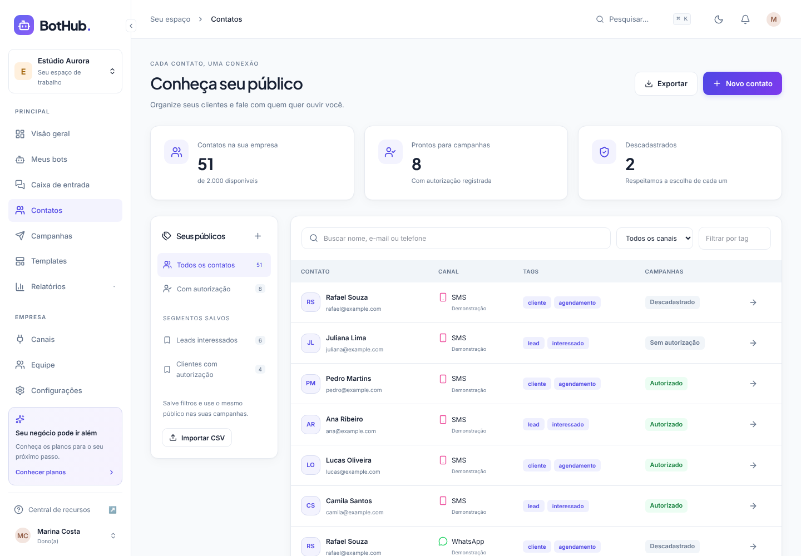
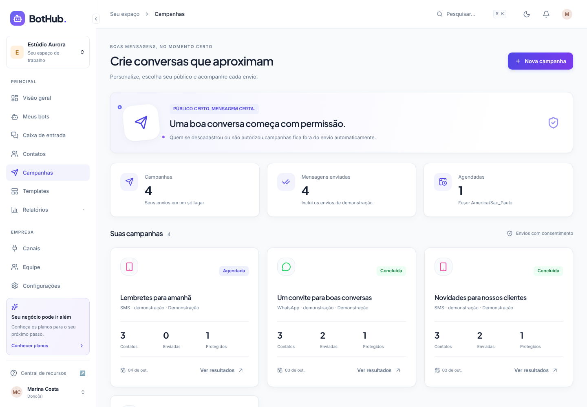
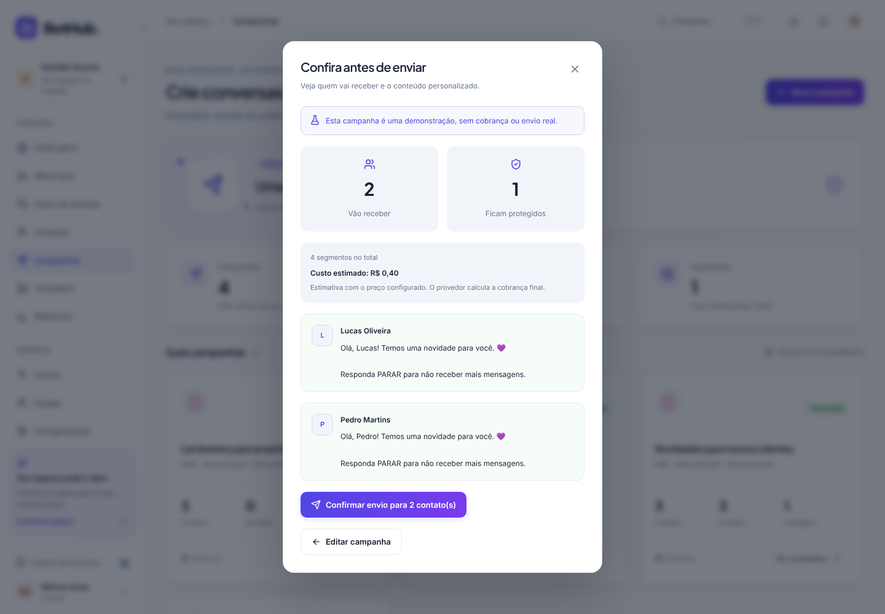
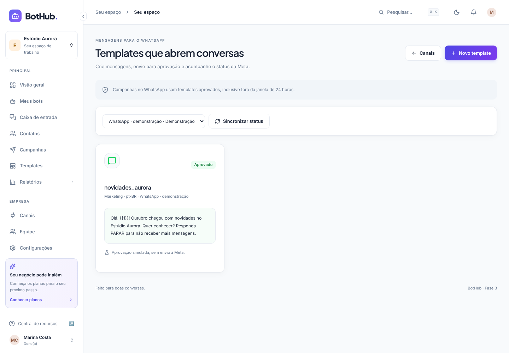
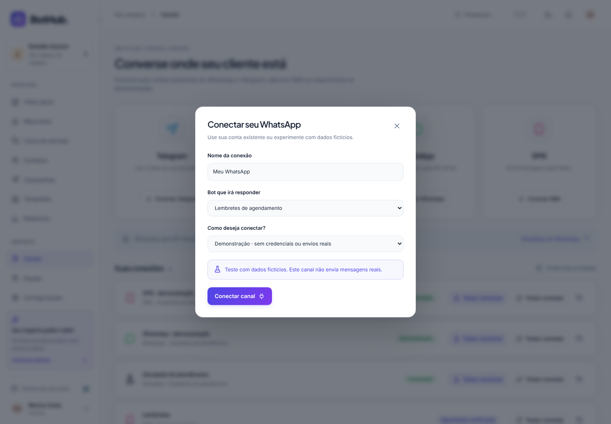
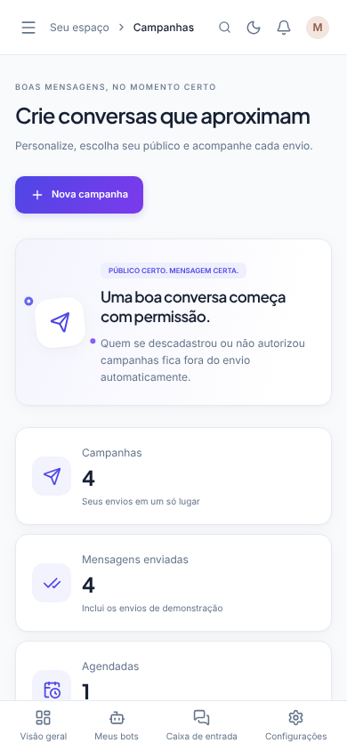

# Demonstração visual do BotHub

Estas são capturas do aplicativo funcionando, com dados fictícios do workspace de demonstração. O simulador executa o motor de fluxos sem enviar mensagens a canais externos.

## 1. Página inicial

A apresentação do produto tem um exemplo de conversa que alterna entre WhatsApp, Telegram e SMS, botões de cadastro, recursos e preços. As seções seguintes ficam abaixo do trecho capturado.

## 2. Painel da empresa

O painel reúne o checklist inicial, conversas ativas, novos contatos, mensagens e conclusão dos fluxos. Os números e gráficos desta conta são exemplos, identificados na interface.

## 3. Templates

Oito modelos podem ser importados para começar o bot: atendimento, leads, agendamento, pedidos, pesquisa de satisfação, delivery, pagamentos e triagem de suporte.

## 4. Editor e simulador

O fluxo de atendimento aparece como cartões conectados. No teste capturado, o cliente escolheu **Horário de atendimento**, o bot respondeu e o caminho percorrido ficou destacado em verde. As variáveis aparecem abaixo do chat. É possível salvar o rascunho, publicar e consultar as versões.

## 5. Caixa de entrada

A lista de conversas fica à esquerda, as mensagens no centro e os detalhes do contato à direita. A conversa de exemplo está em atendimento humano; os controles permitem responder, escrever uma nota interna, devolver ao bot e encerrar.

## 6. Conexões

O Simulador funciona sem credenciais. A tela permite conectar suas contas existentes do Telegram/WhatsApp e SMS oficial da Twilio. Modos de demonstração usam fakes claramente identificados e não fazem envios externos.

## 7. No celular

O layout se adapta à tela menor, com menu móvel e navegação inferior.

## 8. Contatos e segmentos

Cadastro por canal, tags, públicos salvos, busca e autorização para campanhas. Os contatos capturados são fictícios e os canais estão identificados como demonstração.

## 9. Campanhas

A lista mostra campanhas simuladas concluídas e uma agendada. Cada envio verifica as autorizações; contatos bloqueados aparecem como protegidos.

## 10. Antes de enviar

A revisão mostra o público autorizado, quem fica fora e o conteúdo personalizado. SMS também mostra segmentos e custo estimado. A captura não confirma um novo envio.

## 11. Templates do WhatsApp

O template desta captura tem aprovação **simulada**. Em conexões reais, a aprovação vem da Meta e pode ser sincronizada no painel.

## 12. Sua conta existente

Escolha demonstração para testar sem segredos, ou sua conta existente para informar os dados da API oficial. Nenhum novo bot externo será criado.

## 13. Campanhas no celular

O menu, as ações e os cartões se adaptam à tela menor.

## Experimente no seu computador

Siga o [README do projeto](../../README.md) para iniciar o site. Entre com a conta local de demonstração indicada no README e abra **Templates → Editor → Testar** para conversar com o bot. Esta galeria é uma demonstração visual; não representa uma publicação do aplicativo na internet.
